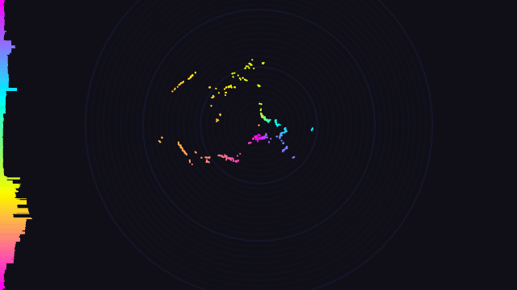
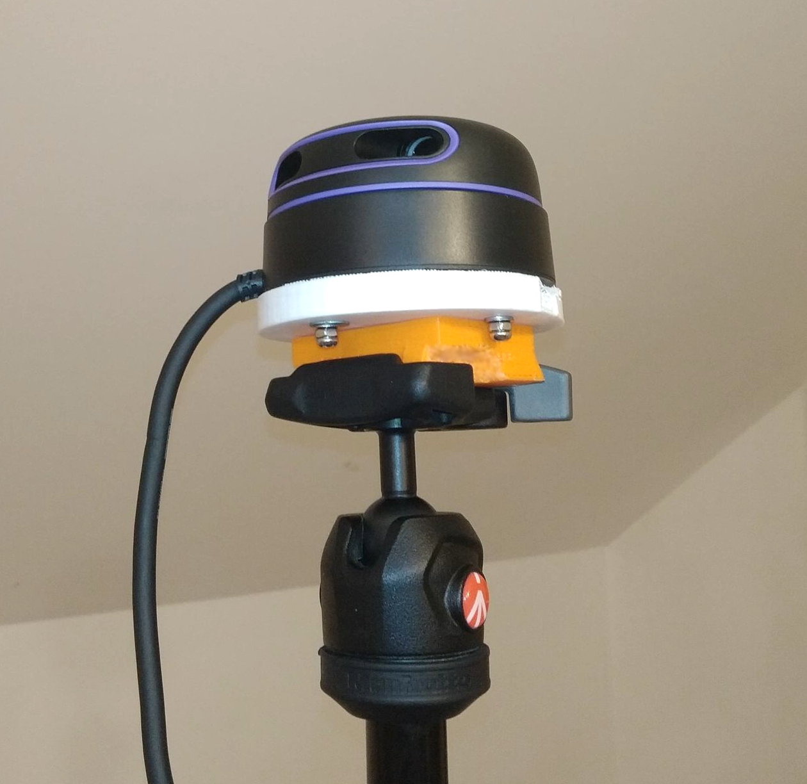
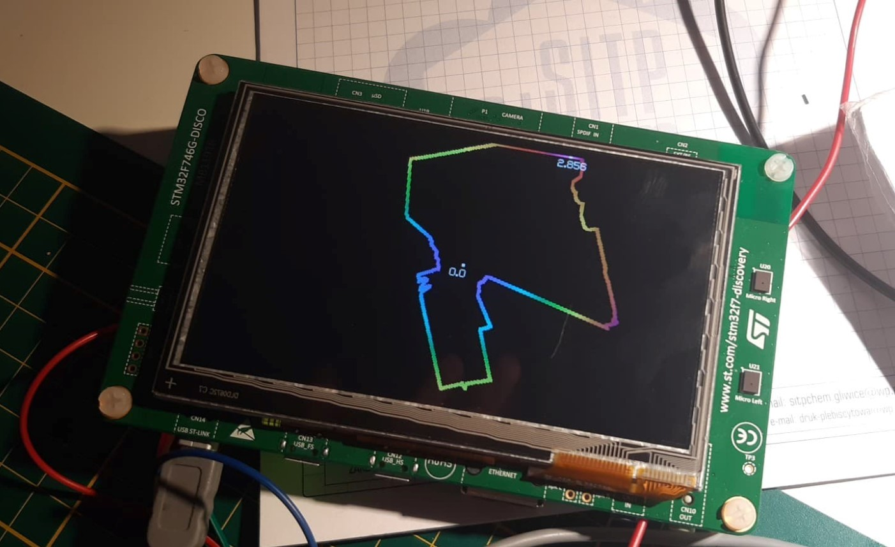

# LIDAR Visualizations

This utility takes advantage of real-time and/or preloaded LIDAR data. It is the first time
I'm messing around which such a device, so I've decided that the first step would be creating
my own data visualization software which also offers some features related to saving and reading
time series of point clouds and some experimental calculations. LIDAR devices have a quite large
potential and this technology can be found in various applications like self-driving vehicles,
robotics, terrain mapping etc.

This project uses **Slamtec RPLIDAR A3M1** device (described below).

## Table of contents

- [Gallery](#gallery)
- [About RPLIDAR](#about-rplidar)
- [Binaries](#binaries)
- [Compilation](#compilation)
  - [Linux, MacOS](#linux-macos)
  - [Windows (Visual Studio)](#windows-visual-studio)
- [Usage](#usage)
  - [Options](#options)
  - [Scenarios](#senarios)
  - [GUIs](#guis)
  - [RPLIDAR Modes](#rplidar-modes)
- [Datasets](#datasets)
  - [Point cloud](#point-cloud)
  - [Point cloud series](#point-cloud-series)
- [RPLIDAR with STM32](#rplidar-with-stm32)
- [Thanks](#thanks)

## Gallery

[Youtube video](https://www.youtube.com/watch?v=MQhYTqz40xI)

Indoor scanning:


Outdoor, obervating of passing cars:


Outdoor, lots of trees and shrubs around:



## About RPLIDAR

This project has been created with the low-cost **Slamtec RPLIDAR A3M1** device, and SDK
provided by its manufacturers. We haven't tested it, but should be compatible with other
related Slamtec models. A3M1 supports two important scanning modes depending on a scanning
environment (indoor/outdoor).

| Property                | A3M1         |
| :---------------------- | ------------ |
| Distance Range          | up to 25 m   |
| Sample Rate             | up to 16 kHz |
| Scan Rate               | 5 Hz - 20 Hz |
| Angular Resolution      | up to 0.225° |
| Communication Interface | TTL UART     |
| Communication Speed     | 256000 bps   |

The complete RPLIDAR specification and documentation is available below:

- [A3M1 website](https://www.slamtec.com/en/Lidar/A3)
- [SDK GitHub](https://github.com/Slamtec/rplidar_sdk)
- [RPLIDAR A3 User Manual](https://download.kamami.pl/p573426-LM310_SLAMTEC_rplidarkit_usermanual_A3M1_v1.0_en.pdf)
- [RPLIDAR A3 Introduction and Datasheet](https://download.kamami.pl/p573426-LD310_SLAMTEC_rplidar_datasheet_A3M1_v1.3_en.pdf)



## Binaries

We're still figuring out the automation process, so in most cases, if you want
to run the program, you need to compile it yourself.

Currently, some older SFML-enabled Windows binaries and some newer "base" Linux releases
are available. Have a look at the GitHub _Releases_ tab.

## Compilation

### Linux, MacOS

1. Install RPLIDAR SDK:

   ```
   ./install_rplidar
   ```

2. Install SFML:

   ```
   ./install_sfml
   ```

3. Build:

   ```
   make USE_SFML=true USE_RPLIDAR=true
   ```

### Windows (Visual Studio)

1. Make sure you have the prerequisities:
   - Visual Studio with C++ toolchain. [visualstudio.microsoft.com/](https://visualstudio.microsoft.com/)
   - SFML 2.5.1 graphical library **(32bit only and must match C++ compiler version)** -
     [sfml-dev.org/download/sfml/2.5.1/](https://www.sfml-dev.org/download/sfml/2.5.1/).
   - RPLIDAR SDK - [github.com/Slamtec/rplidar_sdk](https://github.com/Slamtec/rplidar_sdk).
2. Prepare RPLIDAR SDK:

   - Move the directory containing RPLIDAR SDK to the path of this repository. Rename it to `rplidar-sdk`.

   - Install CP2102 driver which allows communicating via USB and UART: `rplidar_sdk/tools/cp2102_driver`.

   - Open VS solution with SDK: `rplidar_sdk/sdk/workspaces/vc**/sdk_and_demo.sln`.

   - Go to _Solution Explorer_ window, find `rplidar_driver` and open _Properties_ window.
     Switch _Configuration_ to _Release_, go to _C/C++/CodeGeneration_ and change _Runtime Library_
     property to _Multi-threaded DLL (/MD)_. Apply changes and compile `rplidar_driver` in _Debug_
     and _Release_ mode. This will create two `.lib` files which will be used in our final app.
     You can find them here: `rplidar_sdk\sdk\output`. These files will be automatically found
     by the LV project, so don't move them.

     **Note:** If you want to compile the examples derived with the SDK, you should change
     _Runtime Library_ property back to _Multi-threaded (/MT)_ in _Release_ mode because it
     might cause linker errors

   - That's it. SDK is ready and you can close the VS project.

3. Prepare SFML 2.5.1.:

   - Move the directory containing SFML 2.5.1 to the path of this repository and rename it
     to `SFML-2.5.1` **OR** update the paths in _sfml-debug.props_ and _sfml-release.props_.

4. Build:
   - Open the VS solution of _lidar-visualizations_ - `lidar/lidar.sln`.
   - Compile in _Debug_ or _Release_ mode (in _Debug_ mode SFML is linked dynamically, so
     you have to provide necessary DLL's aside your output executable - you will find them in
     `SFML-2.5.1\bin`; in _Release_ mode SFML is linked statically).

**\*** `lidar.sln` uses several project property files (_rplidar.props_, _sfml-debug.props_,
_sfml-release.props_) which consist of relative include and library paths to RPLIDAR SDK and SFML,
and define macros enabling sections of code that requires the specified dependencies
(`USING_RPLIDAR`, `USING_SFML`). For example, if you remove SFML property files from the project,
a compiler won't be looking for SFML and finally it will build the program without the SFML GUI.
You can do the same with RPLIDAR, so you won't be able to receive data from it.

## Usage

When you have the `lidarvis` executable , you are able to start some scanning and visualizing.
The program can be controlled via command line in such a way:

```sh
lidar [options]
```

## Usage with docker

```sh
docker run -v absolute_path_to_datasets:/home lidar -f /home/file.txt
```

### Options

**Input (required)**:

```
-f  --file [filename]          Input cloud filename
-fs --file-series [filename]   Input cloud series filename
-p  --port [portname]          Input RPLIDAR port*
```

**General:**

```
-h  --help                     Display help
-o  --output-dir [dirname]     Output dir
-s  --scenario [id]            Specify scenario (default: 0)
-g  --gui [id]                 Specity GUI (default: 1)
```

**RPLIDAR options\***

```
-m  --rplidar-mode [id]        RPLIDAR scanning mode (default: 4)
-r  --rpm                      RPLIDAR revolutions per minute (default: 660, min: 170, max: 1023)
```

**SFML GUI options\*\***

```
-H  --height [val]              Window height (defualt: 1280)
-W  --width [val]               Window width (defualt: 720)
-C  --colormap [id]             Colormap (0, 1)
-M  --ptr-mode [id]             Points display mode (0, 1, 2)
-B  --bold                      Larger points
-S  --scale [scale]             Scale (1mm -> 1px for scale = 1.0)
```

**\*** RPLIDAR options are unavailable, if they haven't been compiled into the project
(disabled `USING_RPLIDAR` macro).

**\*\*** SFML GUI options are unavailable, if they haven't been compiled into the project
(disabled `USING_SFML` macro).

### Scenarios

Scenarios are sets of actions which are executed just after grabbing the cloud data, and
just before its visualization by the GUI.

```
0    Do nothing, just grab a cloud and visualize (default).
1    Save each cloud as a part of cloud series.
2    Save each cloud as a new screenshot (extremely unoptimized).
```

### GUIs

GUIs are responsible for the visual layer of the application and interacting with user.

```
0    Terminal GUI - prints data as a list of points on stdout.
1    SFML GUI - default, the most beautiful one from the gallery.
```

**SFML GUI Keyboard shortcuts**

```
T                 Save cloud to .txt file
S                 Save screenshot
Arrows            Move cloud
Moude scroll      Scale cloud
Mouse middle      Reset position, autoscale cloud
C                 Switch colormap
M                 Switch points display mode
```

### RPLIDAR Modes

RPLIDAR supports several scanning modes which differs by its application (indoor/outdoor),
distance range, and sample rate. More details can be found in the documentation of the
product. You should only consider the option 3 and 4, because the first three ones are
here due to compatibility reasons and don't produce spectacular results.

```
0    Standard
1    Express
2    Boost
3    Sensitivity (default)
4    Stability
```

## Datasets

As mentioned earlier, LV allows you to save and load point cloud data from your local disk
instead of grabbing it from the RPLIDAR driver. The format of input and output datasets is
very straightforward and can be modified with a basic text editor. We can distinguish two
variants of the data - **point cloud** and **point cloud series**.

### Point cloud

Files contain data of a single point cloud (e.g. a full 360° scan, combined scan). Each
line (except for comments which must start with `#`) represents a single point which
consists of an **angle value [°]** and a **distance value [mm]**. Both may be a floating
point number, and have to be separated by any kind of white characters.

**Example**:

```
# A comment
# Angle [°]   Distance [mm]
90.0    42.0
180.0   1000
270.0   1920.11
360.0   2002.0
```

**Preview**:

```
lidar -f datasets/example.txt
```


### Point cloud series

Files contain a list of point clouds. This variant can be used to record a series of captured
clouds. The rules are the same as in the previous paragraph, but there are some special lines
starting with `!` which separates two point clouds. Each line marked with `!` should consist
of the **ID number of the following point cloud** and **number of milliseconds elapsed from
@grabbing the previous one**. Clouds should be sorted by their ID number.

Example:

```
# A comment
# ! ID Number   Elapsed time [ms]
# Angle [°]   Distance [mm]
! 0 0
120  100
240  100
360  100
! 1 500
120  200
240  200
360  200
! 2 500
120  300
240  300
360  300
! 3 500
```

Preview:

```
lidar -fs datasets/example-series.txt
```


## RPLIDAR with STM32

I also encourage you to follow my friend's project in which he combined lidar technology with
a portable STM32 microcontroller. He created a similar visualization software based on a
completely different low-level platform.

**GitHub**: [https://github.com/knei-knurow/lidar-stm32](https://github.com/knei-knurow/lidar-stm32)



## Thanks

This project was developed within Electronics and Computer Science Club in Knurów
(KNEI for short) where lots of amazing projects and ideas come from. Have a look at
our website - [https://knei.pl/](https://knei.pl/) - unfortunately, at the moment,
only available in Polish. Check out our GitHub too - https://github.com/knei-knurow.

Numerous packages with colourful electronic gadgets like RPLIDAR have been granted to
us by our friends from [KAMAMI.pl](http://kamami.pl).
